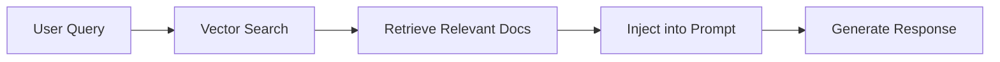
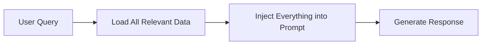

# RAG and CAG: Data Augmentation Strategies

## Summary

This note compares two approaches for enhancing AI-generated responses with external data: **Retrieval-Augmented Generation (RAG)** and **Cache-Augmented Generation (CAG)**. Understanding these strategies helps choose the right approach for different use cases and constraints.

**Key takeaways:**
- RAG is efficient and scalable for large knowledge bases
- CAG provides comprehensive context but requires large context windows
- Choice depends on dataset size, accuracy needs, and resource constraints
- Hybrid approaches can combine benefits of both strategies
- Technical considerations include context limits and performance optimization

## Retrieval-Augmented Generation (RAG)

### How It Works


**Process:**
1. **Query Processing** - Analyze user input
2. **Similarity Search** - Find relevant documents using vector embeddings
3. **Context Injection** - Add retrieved data to prompt
4. **Generation** - LLM generates response with context

### Characteristics
- ✅ **Efficient** - Only retrieves what's needed
- ✅ **Secure** - Minimal data exposure
- ✅ **Scalable** - Works with large knowledge bases
- ✅ **Fresh data** - Can access real-time information
- ❌ **Complex setup** - Requires vector databases, embeddings
- ❌ **May miss connections** - Could overlook loosely related data
- ❌ **Retrieval quality dependent** - Success depends on search accuracy

### Use Cases
- **Large knowledge bases** (documentation, wikis)
- **Security-sensitive environments**
- **Real-time data integration**
- **Cost-conscious applications**

### Implementation Example
```python
# Basic RAG implementation
from sentence_transformers import SentenceTransformer
import faiss
import numpy as np

class SimpleRAG:
    def __init__(self, documents):
        self.documents = documents
        self.model = SentenceTransformer('all-MiniLM-L6-v2')
        
        # Create embeddings and index
        embeddings = self.model.encode(documents)
        self.index = faiss.IndexFlatIP(embeddings.shape[1])
        self.index.add(embeddings.astype('float32'))
    
    def retrieve(self, query, k=3):
        query_embedding = self.model.encode([query])
        scores, indices = self.index.search(query_embedding.astype('float32'), k)
        return [self.documents[i] for i in indices[0]]
    
    def generate_response(self, query, llm_client):
        # Retrieve relevant documents
        relevant_docs = self.retrieve(query)
        
        # Create augmented prompt
        context = "\n".join(relevant_docs)
        prompt = f"""
        Context: {context}
        
        Question: {query}
        
        Answer based on the context provided:
        """
        
        return llm_client.generate(prompt)
```

## Cache-Augmented Generation (CAG)

### How It Works


**Process:**
1. **Broad Data Fetch** - Load all potentially relevant information
2. **Context Injection** - Add everything to prompt context
3. **Generation** - LLM processes full context and generates response

### Characteristics
- ✅ **Less complex** - Simpler architecture
- ✅ **Captures loose connections** - Can find unexpected relationships
- ✅ **Comprehensive context** - No information loss from retrieval
- ✅ **Consistent results** - Same context every time
- ❌ **Less efficient** - Processes more data than needed
- ❌ **Requires large context** - Needs models with big context windows
- ❌ **Higher costs** - More tokens processed per request
- ❌ **Slower processing** - More data to analyze

### Use Cases
- **Small to medium datasets**
- **Exploratory analysis**
- **When relationships are unclear**
- **High-accuracy requirements**

### Implementation Example
```python
# Basic CAG implementation
class SimpleCAG:
    def __init__(self, documents):
        self.documents = documents
    
    def generate_response(self, query, llm_client):
        # Use all documents as context
        full_context = "\n".join(self.documents)
        
        prompt = f"""
        Context: {full_context}
        
        Question: {query}
        
        Answer based on the context provided:
        """
        
        return llm_client.generate(prompt)
```

## Comparison Table

| Aspect | RAG | CAG |
|--------|-----|-----|
| **Efficiency** | ⭐⭐⭐⭐⭐ | ⭐⭐ |
| **Setup Complexity** | ⭐⭐ | ⭐⭐⭐⭐⭐ |
| **Context Quality** | ⭐⭐⭐ | ⭐⭐⭐⭐⭐ |
| **Cost** | ⭐⭐⭐⭐ | ⭐⭐ |
| **Speed** | ⭐⭐⭐⭐ | ⭐⭐ |
| **Scalability** | ⭐⭐⭐⭐⭐ | ⭐⭐ |
| **Connection Discovery** | ⭐⭐⭐ | ⭐⭐⭐⭐⭐ |
| **Security** | ⭐⭐⭐⭐ | ⭐⭐⭐ |

## When to Choose What?

### Choose RAG When:
- 📚 **Large knowledge base** (>1000s of documents)
- 💰 **Cost is a concern** (token usage matters)
- 🔒 **Security is important** (minimize data exposure)
- ⚡ **Speed is critical** (fast response times needed)
- 🔄 **Real-time data** required

### Choose CAG When:
- 📄 **Small dataset** (<100 documents)
- 🔗 **Complex relationships** between data points
- 🎯 **High accuracy** requirements
- 🧠 **Context window** is large (32k+ tokens)
- 🔍 **Exploratory use case** (unclear what's relevant)

## Hybrid Approaches

### Multi-Stage RAG
```python
# First pass: broad retrieval
broad_results = rag.retrieve(query, k=10)

# Second pass: refined retrieval
refined_results = rag.retrieve_refined(query, broad_results, k=3)

# Generate with refined context
response = llm.generate(query, context=refined_results)
```

### Adaptive Context
```python
# Start with RAG, fall back to CAG if needed
def adaptive_generation(query, documents):
    if len(documents) < 50:
        return cag.generate(query, documents)
    else:
        return rag.generate(query, documents)
```

## Technical Considerations

### Context Window Limits
| Model | Context Window | Best For |
|-------|----------------|----------|
| GPT-3.5 | 4,096 tokens | RAG |
| GPT-4 | 8,192 tokens | RAG |
| GPT-4 Turbo | 128,000 tokens | CAG possible |
| Claude 3 | 200,000 tokens | CAG friendly |
| Gemini Pro | 32,768 tokens | Hybrid |

### Performance Optimization

#### For RAG:
```python
# Optimize embedding model
model = SentenceTransformer('all-mpnet-base-v2')  # Better quality
# OR
model = SentenceTransformer('all-MiniLM-L6-v2')   # Faster

# Use approximate search
index = faiss.IndexIVFFlat(quantizer, d, nlist)

# Implement caching
from functools import lru_cache

@lru_cache(maxsize=1000)
def cached_retrieve(query):
    return retrieve(query)
```

#### For CAG:
```python
# Chunk large documents
def chunk_documents(documents, max_chunk_size=1000):
    chunks = []
    for doc in documents:
        for i in range(0, len(doc), max_chunk_size):
            chunks.append(doc[i:i + max_chunk_size])
    return chunks

# Prioritize important content
def prioritize_content(documents, query):
    # Simple scoring based on keyword match
    scored = [(doc, score_relevance(doc, query)) for doc in documents]
    return sorted(scored, key=lambda x: x[1], reverse=True)
```

## Real-World Examples

### RAG Example: Customer Support
```python
# Support ticket system with RAG
class SupportRAG:
    def __init__(self, knowledge_base):
        self.kb = knowledge_base
        self.setup_vector_search()
    
    def answer_ticket(self, customer_query):
        # Find relevant support articles
        relevant_articles = self.retrieve(customer_query, k=3)
        
        # Generate personalized response
        prompt = f"""
        Support Articles: {relevant_articles}
        Customer Question: {customer_query}
        
        Provide a helpful, professional response:
        """
        return self.llm.generate(prompt)
```

### CAG Example: Legal Document Analysis
```python
# Legal contract analysis with CAG
class LegalCAG:
    def __init__(self, contract_clauses):
        self.clauses = contract_clauses
    
    def analyze_contract(self, question):
        # Use all clauses for comprehensive analysis
        full_contract = "\n".join(self.clauses)
        
        prompt = f"""
        Contract: {full_contract}
        Legal Question: {question}
        
        Provide detailed legal analysis considering all clauses:
        """
        return self.llm.generate(prompt)
```

## Tools and Libraries

### RAG Tools
- **LangChain** - Full RAG framework
- **LlamaIndex** - Data indexing and retrieval
- **ChromaDB** - Vector database
- **Pinecone** - Managed vector database
- **FAISS** - Facebook AI similarity search

### CAG Tools
- **Context management** libraries
- **Document chunking** utilities
- **Token counting** tools
- **Large context models** (Claude, GPT-4 Turbo)

## Questions & Next Steps

- [ ] Benchmark performance comparison between RAG and CAG implementations
- [ ] Explore hybrid approaches for different domain-specific use cases
- [ ] Research emerging vector database solutions and their trade-offs
- [ ] Test context window optimization techniques for CAG
- [ ] Investigate adaptive routing strategies between RAG and CAG
- [ ] Evaluate cost implications across different model providers

## Use Cases

### When to Use RAG
- Large knowledge bases with thousands of documents
- Security-sensitive environments requiring minimal data exposure
- Real-time data integration needs
- Cost-conscious applications with token usage concerns
- Applications requiring fast response times

### When to Use CAG
- Small to medium datasets (under 100 documents)
- Complex relationship discovery between data points
- High-accuracy requirements with comprehensive analysis
- Exploratory use cases where relevance is unclear
- Applications with access to large context window models

### Hybrid Scenarios
- Multi-stage retrieval with progressive refinement
- Adaptive context selection based on query complexity
- Domain-specific routing between strategies
- Performance-cost optimization based on usage patterns

## Related Concepts

- [[Vector Databases]] - Storage and retrieval systems for embeddings
- [[Embedding Models]] - Text representation techniques for similarity search
- [[Prompt Engineering]] - Optimization of AI model inputs
- [[AI Model Comparison]] - Analysis of different LLM capabilities
- [[Context Window Optimization]] - Techniques for managing token limits

### See Also
- #rag #cag #ai-architecture #vector-search
- [[MOC - AI Development]] - Map of Content for AI development strategies

## References

- [Retrieval-Augmented Generation for Knowledge-Intensive NLP Tasks](https://arxiv.org/abs/2005.11401) - Original RAG paper
- [LangChain Documentation](https://python.langchain.com/docs/) - RAG implementation framework
- [Vector Database Comparison](https://www.pinecone.io/learn/vector-database/) - Technical analysis of vector storage
- [Context Window Research](https://arxiv.org/abs/2310.16944) - Long context modeling techniques
- Facebook AI. "FAISS: A Library for Efficient Similarity Search." GitHub. 2019.

## Metadata

**Confidence Level:** High
**Last Reviewed:** 2025-07-27
**Review Due:** 2025-08-27

---
*Created: 2025-07-27*
*Last updated: 2025-07-27*
